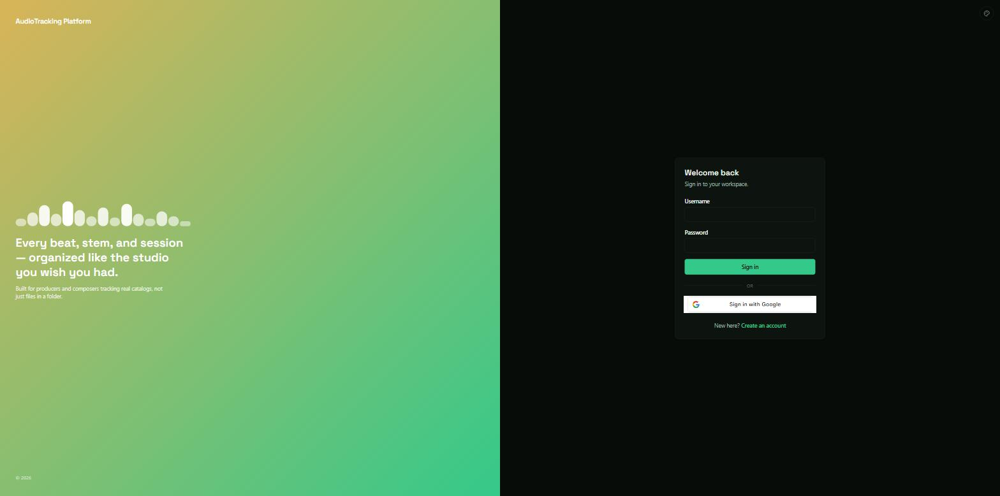
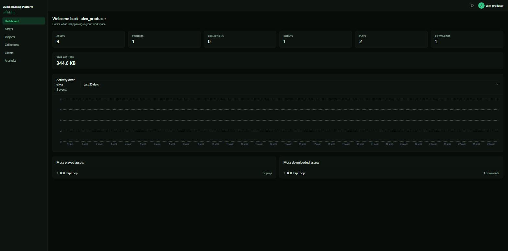
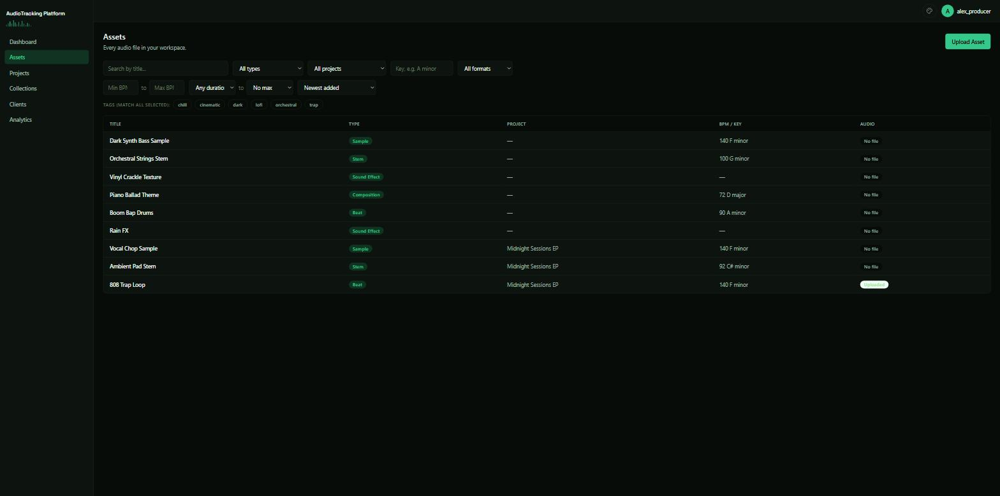
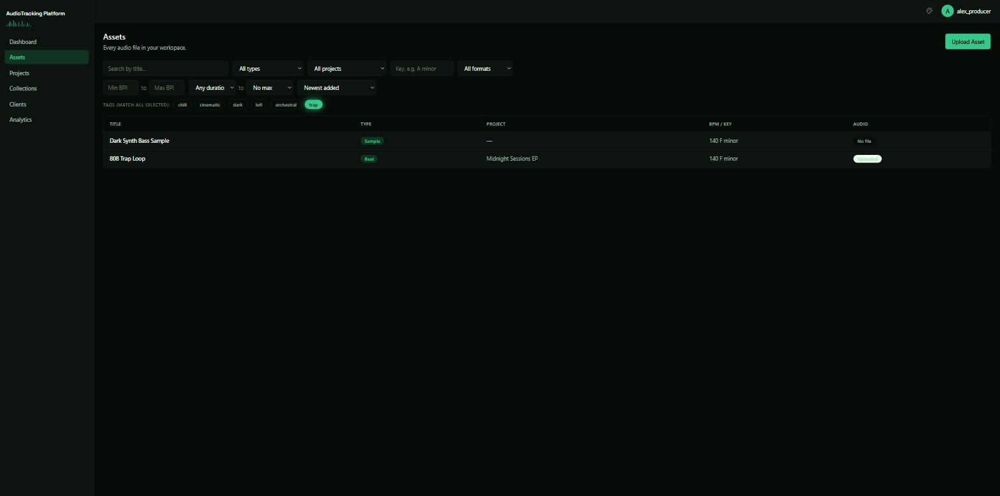
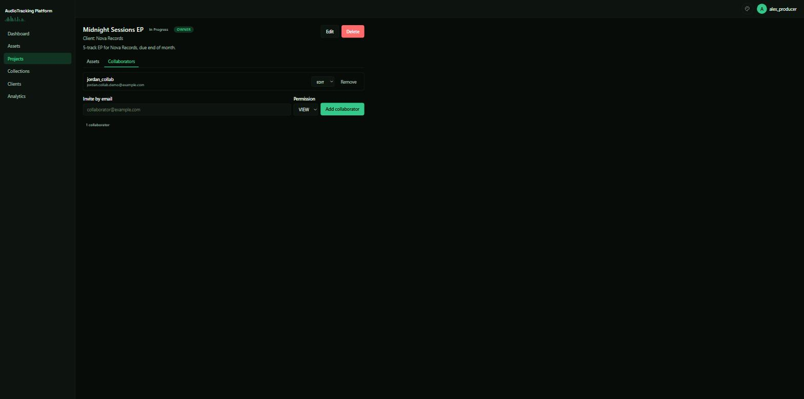
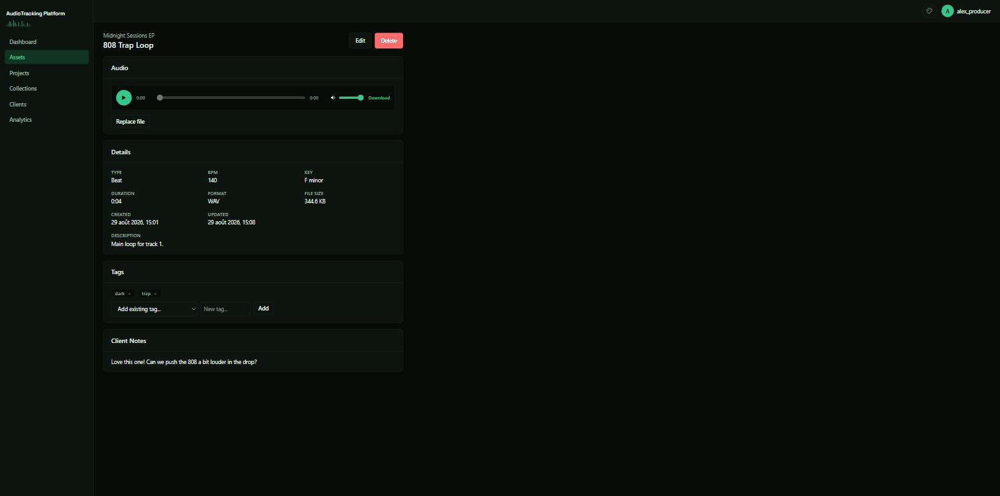
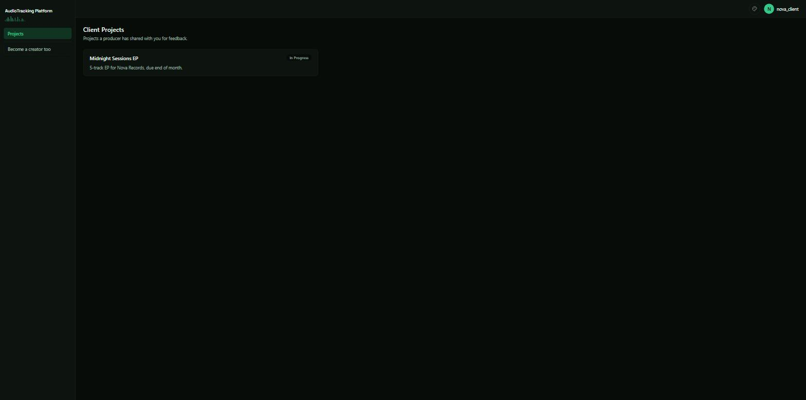

# AudioTracking Platform

## Overview

Producers, composers, beatmakers, sound designers and audio engineers accumulate hundreds or thousands of audio
files across projects — spread across external drives, folders, and cloud storage that don't talk
to each other. Finding one specific file (a particular beat, at a particular BPM and key, from
months ago) usually means opening files one by one and hoping a folder or filename happens to be
memorable enough to help.

AudioTracking Platform centralizes an audio catalog and adds the metadata needed to search it the
way audio professionals actually think about their work — tag (genre, mood, etc.), BPM, musical
key, duration, and file format all filtered through a single searchable library, instead of relying on
folder names and memory to find the right asset at the right moment.

Beyond storage, it tracks the state of ongoing work: Projects move through a status lifecycle,
Collections group related Assets, collaborators can be added to projects to have viewing or editing permission and clients can be assigned to a Project so it's clear who each
piece of work is for and what's still outstanding.

Access isn't tied to a physical drive, either. Files live in cloud object storage and are
reachable from any browser — including, with view-only access, by the Client a Project is for —
so sharing a batch of stems no longer means exporting them onto a drive and handing it over.

General-purpose cloud storage covers file hosting, and generic project-management tools cover task
tracking — but neither is built around the metadata (key, BPM, tag) an audio professional actually
searches by, and neither offers a client-facing, view-only sharing model out of the box.
AudioTracking Platform combines catalog search, project/client organization, and secure sharing in
one tool built specifically for that workflow.

## Features

- **Asset management** — audio files (Beat, Composition, Sample, Sound Effect, Stem), each with
  BPM, musical key, duration, and format, searchable and filterable by all of the above plus tags.
- **Tags** — free-form, per-user tagging (genre, mood, etc.) for organization that cuts across
  Projects and Collections.
- **Projects** — group Assets under a status lifecycle (Planning → In Progress → Completed /
  Archived), optionally attached to a Client.
- **Collections** — lighter-weight grouping of Assets, independent of Projects.
- **Collaboration** — share a Project with another User as VIEW (view/download) or EDIT
  (view/download/add/modify/delete Assets); Project metadata and sharing itself stay owner-only
  regardless of permission level.
- **Client access** — assign a Client to a Project; if the Client's email matches (or is later
  linked to) a User account, that account automatically gets view-only access to the Project and
  can leave feedback ("client notes") on individual Assets — no separate invite step.
- **Analytics dashboard** — usage data (uploads, plays, downloads, project activity, collaboration
  activity) aggregated from a recorded event log, not fabricated client-side.
- **Authentication** — username/password (BCrypt-hashed) or Google Sign-In, both issuing the same
  JWT.

## Screenshots

**Login** — one of five selectable themes; supports both password and Google Sign-In.



**Dashboard** — real usage data aggregated from a recorded event log, not fabricated client-side.



**Asset library** — nine Assets spanning all five types (Beat, Composition, Sample, Sound Effect,
Stem), with varied BPM, key, tags, and project assignment.



**Filtered by tag** — the same library narrowed from nine Assets to two by selecting the "trap"
tag; BPM, key, type, project, and duration filter the same way.



**Project collaborators** — inviting a collaborator by email with VIEW or EDIT permission; Project
metadata and sharing itself stay owner-only regardless of permission level.



**Asset detail** — BPM/key/duration/tags for filtering, the audio player, and a client's feedback
note on this specific Asset.



**Client portal** — the deliberately minimal UI shown to an account that only exists to view a
Project it's the client for.



## Architecture

```
Browser
   │  HTTPS
   ▼
React + TypeScript SPA  ─────────────────────  Cloudflare Pages (static hosting)
   │  REST API (JWT Bearer token)
   ▼
Spring Boot API  ──────────────────────────────  Docker container on Render
   │                              │
   │ JDBC (Flyway-managed schema) │ S3-compatible API
   ▼                              ▼
PostgreSQL (Neon)              Cloudflare R2
metadata only                   audio files only
```

Metadata and binary storage are deliberately separate systems: PostgreSQL never stores audio
bytes, and the Spring Boot API is the only thing that ever talks to either the database or R2 —
the frontend never accesses either directly. Standard layered backend architecture throughout:
Controller → Service → Repository → PostgreSQL, with DTOs at the boundary so a controller never
returns a JPA entity directly.

## Tech Stack

| Layer | Technology | Role |
| --- | --- | --- |
| Backend | Java 26, Spring Boot 4.1 | Application runtime and REST API |
| | Spring Data JPA / Hibernate | ORM, entity persistence |
| | Spring Security + JWT | Stateless authentication |
| | PostgreSQL + Flyway | Relational metadata store, versioned schema migrations |
| | AWS SDK for Java (S3 module) | Talks to Cloudflare R2 via its S3-compatible API |
| Frontend | React 19 + TypeScript (strict) | UI, type-safe component model |
| | Vite | Dev server and production bundler |
| | TanStack Query | Server-state fetching, caching, cache invalidation |
| | Tailwind CSS v4 + Radix UI | Styling and accessible interaction primitives |
| Infrastructure | Docker | Packages the backend for deployment |
| | GitHub Actions | CI (test + build every push/PR) and CD (deploy only after CI passes) |
| | Render / Neon / Cloudflare Pages / R2 | Backend hosting / managed Postgres / frontend hosting / object storage |

## Technical Decisions

- **Storage is abstracted behind an interface.** `AssetService` depends on `StorageService`, never
  on `R2StorageService` or any AWS SDK type directly — a future S3 (or other provider)
  implementation would require zero changes above the storage layer. See
  [docs/storage.md](docs/storage.md).
- **One authorization chokepoint.** Every Project/Asset/Client permission check goes through
  `ProjectAccessService`, with a deliberate, consistently-applied 404-vs-403 rule: 404 when the
  caller has no relationship to a resource at all (hides its existence), 403 when they do but lack
  sufficient permission (existence is already known, so there's nothing left to hide). See
  [docs/collaboration.md](docs/collaboration.md).
- **Permission checks on the frontend are allow-lists, never deny-lists.** A deny-list
  (`myRole !== 'VIEW'`) silently grants new roles edit rights the moment they're added — caught via
  a deliberate audit before it shipped as a live bug. See [docs/frontend.md](docs/frontend.md).
- **Analytics are actor-centric, not creator-centric** — every metric answers "what did this user
  do," uniformly, rather than switching interpretation per field. See
  [docs/analytics.md](docs/analytics.md) for the full reasoning and the tradeoffs considered.
- **Database migrations, not schema auto-generation.** Production uses Flyway with a baseline
  migration generated directly from the real schema (not hand-written), so it can't drift from
  what the entity code actually produces. See [docs/deployment.md](docs/deployment.md).
- **Deploys are gated on tests passing, structurally, not by discipline.** GitHub Actions'
  deployment workflow only triggers after the test/build workflow succeeds, and both hosting
  platforms' own auto-deploy-on-push is deliberately left off so that path can't be bypassed.

## Authentication & Authorization

Authentication issues a JWT via either username/password (BCrypt-hashed) or Google Sign-In
(ID-token verification) — both paths converge on the same token, and every request afterward is
stateless (no server-side session).

Authorization is role-based per Project, resolved server-side and never re-derived by the
frontend:

| Role | Can do |
| --- | --- |
| **Owner** | Everything, including managing collaborators, sharing, and deleting the Project |
| **Edit collaborator** | View, download, add, modify, and delete Assets — not Project metadata, sharing, or deletion |
| **View collaborator** | View and download Assets only |
| **Client** | View-only access to a Project it's assigned to, plus writing feedback notes on individual Assets |

Collaborators can never grant themselves (or anyone else) additional permissions, and cannot share
a Project further — every share create/update/remove operation is owner-only, with no exceptions.
Full detail, including the deletion/revocation semantics: [docs/collaboration.md](docs/collaboration.md).

## Storage Architecture

Audio files are large binaries that don't belong in a relational database — PostgreSQL stores an
Asset's metadata (title, BPM, key, tags, ownership); the audio file itself lives in Cloudflare R2,
accessed only through a `StorageService` abstraction (see Technical Decisions above). R2 is never
public: `Asset.storageKey` is a stable internal pointer, not a URL, and every file access goes
through a freshly generated, short-lived presigned URL. R2 was chosen specifically because it's
S3-compatible (the official AWS SDK works against it unmodified, just pointed at a different
endpoint) and has no egress fees, which matters for an app built around repeatedly downloading
media. Full detail: [docs/storage.md](docs/storage.md).

## Testing

482 backend tests (JUnit + Spring Boot Test) and 61 frontend tests (Vitest + React Testing
Library + MSW), run automatically on every pull request and push via GitHub Actions. Backend
integration tests run against a real, ephemeral PostgreSQL instance — not an in-memory or mocked
database — specifically so a passing test means the actual JPA/SQL/Flyway behavior works, not just
that a fake stood in for it correctly.

## CI/CD

GitHub Actions runs two workflows:

- **CI** — on every pull request and push: backend tests (against a real Postgres service
  container), frontend tests and build, and a Docker build check. Any failure fails the workflow.
- **CD** — triggered only after CI succeeds: deploys the backend (via Render's deploy hook, which
  builds the Docker image server-side) and the frontend (built with production config, then pushed
  to Cloudflare Pages). Both platforms' own auto-deploy-on-push is disabled, so this pipeline is
  the only path to production — a broken push cannot reach it.

Full pipeline detail, environment setup, and the production architecture it deploys to:
[docs/deployment.md](docs/deployment.md).

## Setup

Requires JDK 26, Node 22+, and a local PostgreSQL instance.

```bash
# Backend
cp src/main/resources/application-local.properties.example src/main/resources/application-local.properties
# fill in your local Postgres credentials and a JWT secret (openssl rand -hex 32)
./mvnw spring-boot:run          # http://localhost:8080

# Frontend
cd frontend
npm install
npm run dev                     # http://localhost:5173
```

Cloudflare R2 credentials are required even for local development (there's no storage mock) — see
[docs/storage.md](docs/storage.md) for how to obtain and set them.

## Environment Variables

| Variable | Required | Purpose |
| --- | --- | --- |
| `DATABASE_URL` / `DATABASE_USERNAME` / `DATABASE_PASSWORD` | yes | PostgreSQL connection (JDBC URL format) |
| `JWT_SECRET` | yes | Signs authentication tokens |
| `R2_ENDPOINT` / `R2_ACCESS_KEY_ID` / `R2_SECRET_ACCESS_KEY` / `R2_BUCKET` | yes | Cloudflare R2 access |
| `CORS_ALLOWED_ORIGINS` | no (defaults to the local Vite origin) | Allowed frontend origin(s) |
| `GOOGLE_OAUTH_CLIENT_ID` | no (has a working default) | Google Sign-In audience |
| `VITE_API_BASE_URL` (frontend) | yes | Backend API URL |

No default is ever a real credential — anything genuinely secret fails startup loudly if unset
rather than falling back silently. Full reference, including production-specific variables:
[docs/deployment.md](docs/deployment.md).

## Development approach

Features are developed incrementally as complete end-to-end vertical slices before expanding the domain model.

Phase 1
- User entity
- CRUD API
- PostgreSQL integration
- Postman testing

Phase 2
- Authentication
- JWT
- Password hashing

Phase 3
- Asset system
- Metadata management
- File upload pipeline

Phase 4
- Cloud object storage integration
- AWS S3 abstraction layer

See [docs/storage.md](docs/storage.md) for how audio file storage is configured and why.

Phase 5
- Clients
- Project collaboration and sharing (VIEW/EDIT permissions)

See [docs/collaboration.md](docs/collaboration.md) for the authorization model behind sharing.

Phase 6
- Analytics events and aggregated insights

See [docs/analytics.md](docs/analytics.md) for the event-recording/aggregation split and why it's designed the way it is.

Phase 7
- React + TypeScript frontend consuming the REST API

See [docs/frontend.md](docs/frontend.md) for the stack, auth flow, permission-aware UI, and how to
run it.

Phase 8
- Production deployment: Render (backend, Docker), Neon (Postgres), Cloudflare Pages (frontend)
- Flyway-managed database migrations, replacing dev-only schema auto-update
- GitHub Actions CI (tests + build on every PR/push) and CD (deploys only after CI passes)

See [docs/deployment.md](docs/deployment.md) for the full architecture, required environment
variables, deployment steps for each service, the CI/CD pipeline, migration workflow, cost
breakdown, and the security review.

## Lessons Learned

Coming from a Java-only background with a little HTML/CSS, most of this stack was new: Spring
Boot's ecosystem, React, TypeScript, and everything around deployment.

- **Layered architecture and React were the steepest learning curves.** Spring Boot's Controller →
  Service → Repository separation and dependency injection took real practice to internalize as
  more than just Java with extra annotations, and React's component/state/hooks model is a
  fundamentally different way of thinking about a UI than anything HTML/CSS alone prepares you
  for.
- **I used to think of interfaces and abstraction layers as unnecessary extra structure — this
  project changed that.** Depending on a `StorageService` interface instead of `R2StorageService`
  directly, or routing every Project permission check through one `ProjectAccessService`, means a
  future storage provider or a new permission rule only ever has to change in one place instead of
  being scattered across the codebase.
- **The frontend can't be trusted with anything sensitive.** DTOs never expose password hashes or
  internal fields, secrets (database credentials, JWT signing key, R2 keys) never leave the
  backend, and the frontend only ever renders a permission decision the backend already made. Understanding why that boundary has
  to be absolute, not just a convention, was one of the bigger mental shifts of this project.
